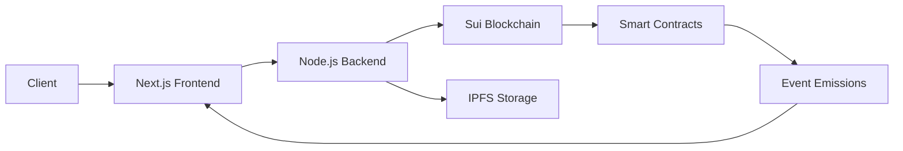

<div align="center">

# 🚢 Global Supply Chain 

[](https://nextjs.org/)
[](https://nodejs.org/)
[](https://www.typescriptlang.org/)
[](https://sui.io/)
[](https://ipfs.io/)

**A blockchain-powered supply chain tracking system built with Next.js 15, Node.js (TypeScript), and Sui Move smart contracts**

*Ensuring transparency, traceability, and integrity across global logistics operations*

[Features](#-features) • [Architecture](#-architecture) • [Quick Start](#-quick-start) • [Documentation](#-api-documentation) • [Contributing](#-contributing)

</div>

---

## 🧭 Overview

This enterprise-grade system revolutionizes supply chain management by recording and verifying logistics events across multiple domains using blockchain technology. Built on the Sui blockchain, it ensures **immutable tracking** from production through transport to final verification.

### 🎯 Supported Logistics Flows

| Domain | Description | Status |
|--------|-------------|--------|
| 🚢 **Maritime Shipping** | Ocean freight and port operations | ✅ Active |
| ✈️ **Aviation Cargo** | Air freight and customs clearance | ✅ Active |
| 🚂 **Railway Logistics** | Rail transport and intermodal | ✅ Active |
| 🎨 **Artisan Certification** | Product origin and authenticity | ✅ Active |

---

## ✨ Features

<table>
<tr>
<td width="50%">

### 🔐 Security & Trust
- **Blockchain Immutability** via Sui Move
- **SHA-256 Hashing** for data integrity
- **Cryptographic Verification** at every step
- **Zero-knowledge Proofs** for sensitive data

</td>
<td width="50%">

### 🚀 Performance
- **Real-time Tracking** with low latency
- **Scalable Architecture** for global operations
- **IPFS Integration** for metadata storage
- **Optimized Smart Contracts** for gas efficiency

</td>
</tr>
<tr>
<td width="50%">

### 💼 Enterprise Ready
- **Multi-tenant Support** for organizations
- **Role-based Access Control** (RBAC)
- **Audit Trail** with complete history
- **API-first Design** for easy integration

</td>
<td width="50%">

### 🎨 Developer Experience
- **Type-safe** with TypeScript
- **Monorepo Structure** for code sharing
- **Comprehensive Testing** suite
- **Hot Module Replacement** for rapid development

</td>
</tr>
</table>

---

## 🏗️ Architecture

```
global-supply-chain/
├── 📦 blockchain-sui/          # Sui Move Smart Contracts
│   ├── sources/                # Contract source files
│   ├── tests/                  # Move unit tests
│   └── Move.toml               # Package manifest
│
├── 🔧 backend/                 # Node.js API Service
│   ├── src/
│   │   ├── config
|   |   ├── controllers/        # Request handlers
│   │   ├── services/           # Business logic
|   |   ├── routes       
│   │   ├── middleware/         # Express middleware
│   │   └── utils/              # Helpers (IPFS, SHA-256)
│   └── package.json
│
├── 🎨 frontend/                # Next.js 15 Application
│   ├── app/                    # App Router pages
│   ├── components/             # React components
│   ├── lib/                    # Utilities & hooks
│   └── public/                 # Static assets
│
└── 📚 shared/                  # Shared TypeScript Module
    ├── types/                  # Common interfaces
    └── constants/              # Shared constants
```

### 🔄 Data Flow



---

## ⚙️ Tech Stack

### Frontend Layer
| Technology | Purpose | Version |
|------------|---------|---------|
| **Next.js** | React framework with App Router | `15.x` |
| **TailwindCSS** | Utility-first styling | `3.x` |
| **@mysten/dapp-kit** | Sui wallet integration | Latest |
| **React Query** | Data fetching & caching | `5.x` |

### Backend Layer
| Technology | Purpose | Version |
|------------|---------|---------|
| **Node.js** | Runtime environment | `20+` |
| **Express** | Web framework | `4.x` |
| **TypeScript** | Type safety | `5.x` |
| **IPFS Client** | Decentralized storage | Latest |

### Blockchain Layer
| Technology | Purpose | Version |
|------------|---------|---------|
| **Sui Move** | Smart contract language | Latest |
| **Sui CLI** | Development toolkit | `1.x` |
| **@mysten/sui.js** | JavaScript SDK | Latest |

---

## 📦 Requirements

Before you begin, ensure you have the following installed:

- **Node.js** `20.x` or higher ([Download](https://nodejs.org/))
- **npm** `10.x` or **pnpm** `8.x` ([pnpm recommended](https://pnpm.io/))
- **Sui CLI** ([Installation Guide](https://docs.sui.io/build/install))
- **Git** for version control

### Verification

```bash
node --version  # Should show v20.x or higher
npm --version   # Should show v10.x or higher
sui --version   # Should show sui 1.x.x
```

---

## 🚀 Quick Start

### 1️⃣ Clone & Install

```bash
# Clone the repository
git clone https://github.com/your-org/global-supply-chain.git
cd global-supply-chain

# Install all dependencies
npm install
```

### 2️⃣ Environment Setup

<details>
<summary><b>Backend Configuration</b> - Click to expand</summary>

Create `backend/.env`:

```env
# Server Configuration
PORT=4000
NODE_ENV=development

# Sui Blockchain
SUI_RPC_URL=https://fullnode.testnet.sui.io:443
SUI_NETWORK=testnet

# IPFS Configuration
IPFS_KEY=your_ipfs_api_key_here
IPFS_SECRET=your_ipfs_secret_here

# Security
SECRET_PHRASE=your_wallet_mnemonic_phrase_here
JWT_SECRET=your_jwt_secret_here

# Logging
LOG_LEVEL=debug
```

</details>

<details>
<summary><b>Frontend Configuration</b> - Click to expand</summary>

Create `frontend/.env.local`:

```env
# API Configuration
NEXT_PUBLIC_API_URL=http://localhost:4000
NEXT_PUBLIC_WS_URL=ws://localhost:4000

# Sui Configuration
NEXT_PUBLIC_SUI_NETWORK=testnet
NEXT_PUBLIC_SUI_RPC_URL=https://fullnode.testnet.sui.io:443

# Feature Flags
NEXT_PUBLIC_ENABLE_ANALYTICS=false
NEXT_PUBLIC_ENABLE_DEBUG=true
```

</details>

### 3️⃣ Run Development Servers

```bash
# Terminal 1 - Backend API
npm run dev:api

# Terminal 2 - Frontend
npm run dev:web

# Terminal 3 - Type checking (optional)
npm run type-check
```

🎉 **Access the application:**
- Frontend: http://localhost:3000
- Backend API: http://localhost:4000
- API Docs: http://localhost:4000/api-docs

---

## ⛓️ Blockchain Development

### Build Smart Contracts

```bash
cd blockchain-sui

# Build Move contracts
sui move build

# Run unit tests
sui move test

# Run tests with coverage
sui move test --coverage
```

### Deploy to Testnet

```bash
# Ensure you have testnet SUI tokens
sui client faucet

# Publish contracts
sui client publish --gas-budget 100000000

# Save the package ID from output
export PACKAGE_ID=0x...
```

### Interact with Contracts

```bash
# Call a Move function
sui client call \
  --package $PACKAGE_ID \
  --module supply_chain \
  --function create_shipment \
  --args "Shipment001" "Shanghai" "Los Angeles" \
  --gas-budget 10000000
```

---

## 🔌 API Documentation

### Base URL
```
Development: http://localhost:4000
Production: https://api.yourdomain.com
```

### Authentication
```bash
# All requests require Bearer token
Authorization: Bearer <your_jwt_token>
```

### Endpoints

#### 🎨 Artisan Services

<details>
<summary><code>POST /artisan/birth-certificate</code> - Create Product Origin Certificate</summary>

**Request Body:**
```json
{
  "productId": "ART-2024-001",
  "artisanName": "John Smith",
  "origin": "Florence, Italy",
  "materialHash": "0x3f5a...",
  "timestamp": 1704067200000
}
```

**Response:**
```json
{
  "success": true,
  "txHash": "0x9b2c...",
  "certificateId": "CERT-001",
  "ipfsHash": "QmX7Y..."
}
```

</details>

#### ✈️ Aviation Services

<details>
<summary><code>POST /aviation/declaration</code> - Register Air Cargo</summary>

**Request Body:**
```json
{
  "flightNumber": "AA123",
  "origin": "JFK",
  "destination": "LAX",
  "cargoWeight": 5000,
  "manifestHash": "0x7d3e..."
}
```

**Response:**
```json
{
  "success": true,
  "declarationId": "AIR-2024-001",
  "txHash": "0x4f2a..."
}
```

</details>

#### 🚢 Maritime Services

<details>
<summary><code>POST /maritime/declaration</code> - Register Sea Freight</summary>

**Request Body:**
```json
{
  "vesselName": "MSC Gulsun",
  "imoNumber": "9811000",
  "portOfLoading": "Shanghai",
  "portOfDischarge": "Rotterdam",
  "containerIds": ["MSCU1234567", "MSCU7654321"]
}
```

</details>

#### 🚂 Railway Services

<details>
<summary><code>POST /railway/declaration</code> - Register Rail Transport</summary>

**Request Body:**
```json
{
  "trainNumber": "CR400AF-001",
  "departureStation": "Beijing",
  "arrivalStation": "Hamburg",
  "wagonIds": ["W-001", "W-002"],
  "cargoType": "Electronics"
}
```

</details>

### Response Codes

| Code | Description |
|------|-------------|
| `200` | Success |
| `201` | Created |
| `400` | Bad Request |
| `401` | Unauthorized |
| `404` | Not Found |
| `500` | Server Error |

---

## 🔒 Security Best Practices

### 🚨 Critical Security Rules

- ✅ **Never commit `.env` files** to version control
- ✅ **Rotate secrets** regularly (every 90 days)
- ✅ **Use environment variables** for all sensitive data
- ✅ **Enable 2FA** on all production accounts
- ✅ **Audit smart contracts** before mainnet deployment

### 🛡️ Security Features

| Feature | Implementation |
|---------|----------------|
| **Data Integrity** | SHA-256 hashing for all transactions |
| **Immutability** | Blockchain-based audit trail |
| **Access Control** | JWT + role-based permissions |
| **Encryption** | TLS 1.3 for data in transit |
| **Storage** | IPFS for decentralized metadata |

---

## 🧪 Testing

### Run All Tests

```bash
# Unit tests
npm run test

# Integration tests
npm run test:integration

# E2E tests
npm run test:e2e

# Coverage report
npm run test:coverage
```

### Smart Contract Tests

```bash
cd blockchain-sui
sui move test --coverage

# Specific module
sui move test --filter supply_chain
```

### Frontend Tests

```bash
cd frontend

# Component tests
npm run test:components

# Visual regression tests
npm run test:visual
```

---

## 📚 Scripts Reference

| Command | Description |
|---------|-------------|
| `npm run dev:web` | Start Next.js frontend (port 3000) |
| `npm run dev:api` | Start Express backend (port 4000) |
| `npm run build` | Build all projects for production |
| `npm run lint` | Run ESLint on all packages |
| `npm run format` | Format code with Prettier |
| `npm run type-check` | Type-check TypeScript files |
| `npm run clean` | Remove build artifacts |

---

## 📖 Documentation

- 📘 [Architecture Guide](./docs/ARCHITECTURE.md)
- 🔧 [API Reference](./docs/API.md)
- 🎨 [Frontend Development](./docs/FRONTEND.md)
- ⛓️ [Smart Contract Guide](./docs/BLOCKCHAIN.md)
- 🚀 [Deployment Guide](./docs/DEPLOYMENT.md)

---

## 🗺️ Roadmap

### Q1 2024
- [x] Core blockchain infrastructure
- [x] Basic API endpoints
- [x] Frontend MVP
- [ ] Multi-language support

### Q2 2024
- [ ] **CI/CD Pipeline** with GitHub Actions
- [ ] **Docker Deployment** with Kubernetes
- [ ] **Event Indexer Service** for real-time updates
- [ ] **Advanced Analytics Dashboard**

### Q3 2024
- [ ] **Role-based Access Control** (RBAC)
- [ ] **Mobile Application** (React Native)
- [ ] **IoT Integration** for automated tracking
- [ ] **AI-powered Predictions** for logistics optimization

### Q4 2024
- [ ] **Multi-chain Expansion** (Ethereum, Polygon)
- [ ] **Enterprise Features** (SSO, custom branding)
- [ ] **Advanced Reporting** & compliance tools
- [ ] **Mainnet Launch** 🚀

---

## 🤝 Contributing

We welcome contributions! Please see our [Contributing Guide](./CONTRIBUTING.md) for details.

### Development Workflow

1. **Fork** the repository
2. **Create** a feature branch (`git checkout -b feature/amazing-feature`)
3. **Commit** your changes (`git commit -m 'Add amazing feature'`)
4. **Push** to the branch (`git push origin feature/amazing-feature`)
5. **Open** a Pull Request

### Code Style

- Follow **TypeScript best practices**
- Use **Conventional Commits** format
- Maintain **test coverage** above 80%
- Document **public APIs** with JSDoc

---

## 📄 License

This project is licensed under the **MIT License** - see the [LICENSE](./LICENSE) file for details.

---

## 👥 Team

<table>
<tr>
<td align="center">
<br />
<b>Lead Developer</b><br />
<sub>Blockchain & Backend</sub>
</td>
<td align="center">
<br />
<b>Frontend Lead</b><br />
<sub>UI/UX & React</sub>
</td>
<td align="center">
<br />
<b>DevOps Engineer</b><br />
<sub>Infrastructure & CI/CD</sub>
</td>
</tr>
</table>

---

## 🙏 Acknowledgments

- **Sui Foundation** for blockchain infrastructure
- **Next.js Team** for the amazing framework
- **IPFS Community** for decentralized storage
- **Open Source Contributors** worldwide

---

## 📞 Support

- 📧 Email: support@yourdomain.com
- 💬 Discord: [Join our community](https://discord.gg/your-server)
- 🐦 Twitter: [@YourProject](https://twitter.com/yourproject)
- 📖 Docs: [docs.yourdomain.com](https://docs.yourdomain.com)

---

<div align="center">

**Made with ❤️ by the Global Supply Chain Team**

⭐ Star us on GitHub — it motivates us a lot!

[Report Bug](https://github.com/your-org/global-supply-chain/issues) • [Request Feature](https://github.com/your-org/global-supply-chain/issues) • [Documentation](https://docs.yourdomain.com)

</div>
